# GitHub Actions 自动化部署架构图

## 🏗️ 整体架构

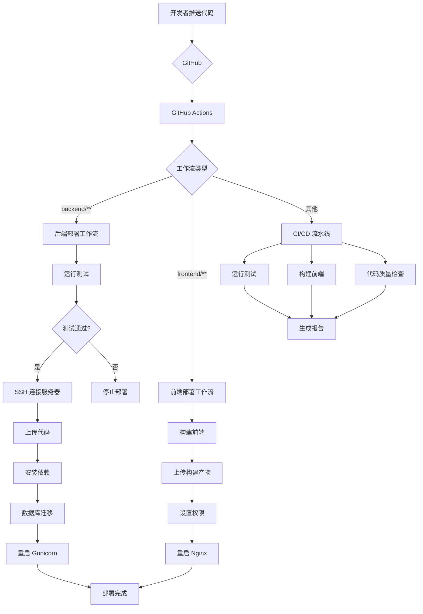

## 🔄 后端部署流程

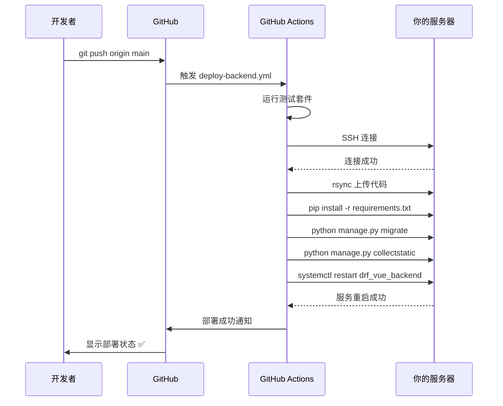

## 🎨 前端部署流程

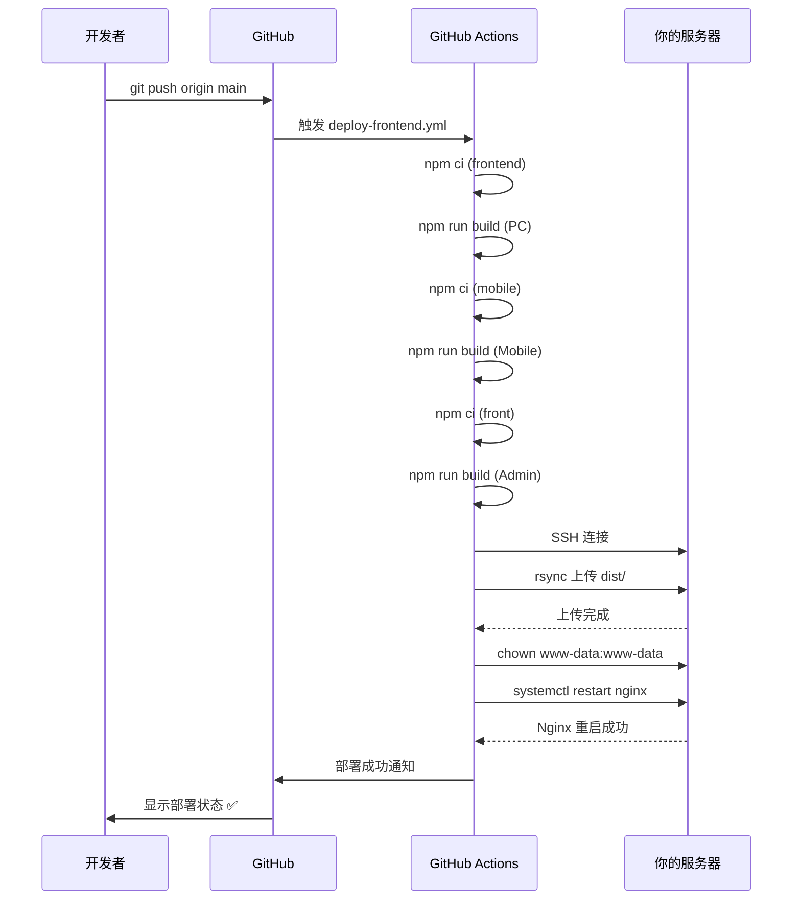

## 🛠️ 技术栈架构

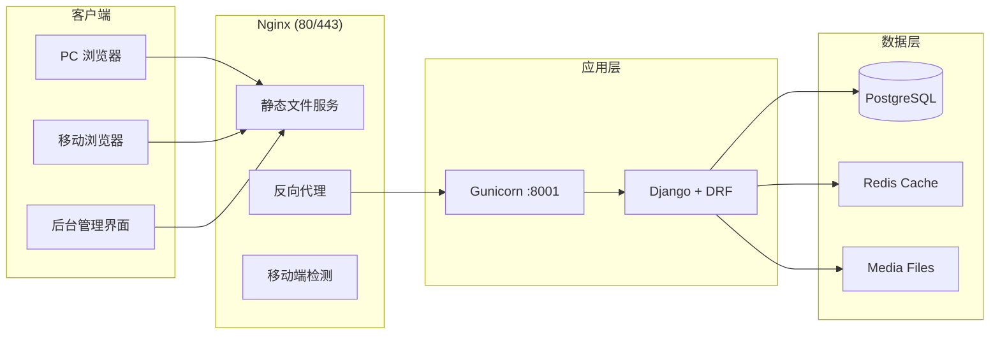

## 📊 CI/CD 流水线

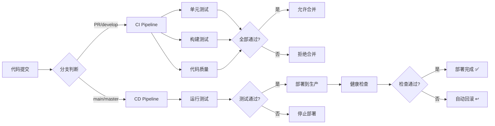

## 🔐 安全架构

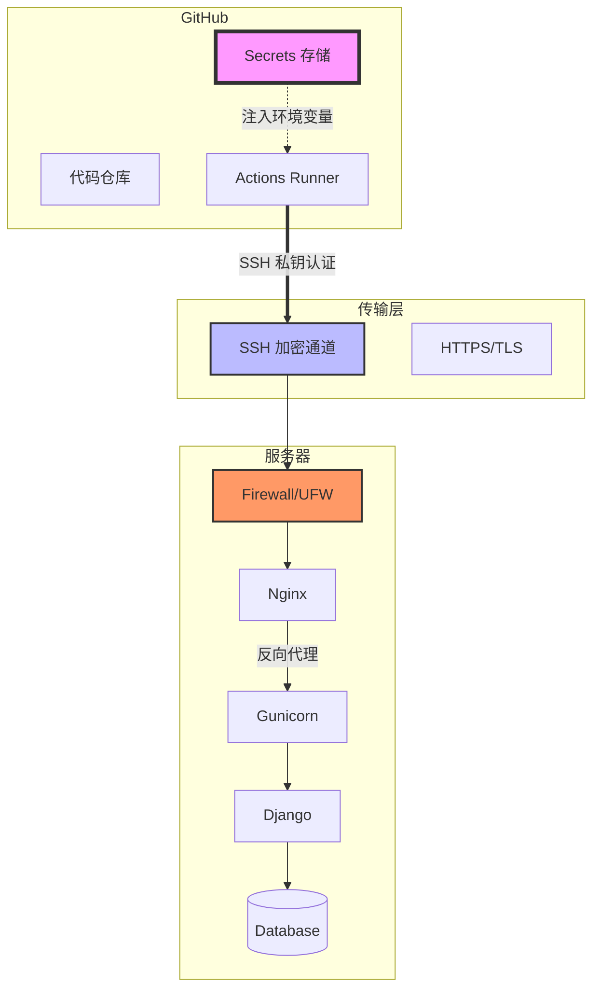

## 📁 目录结构映射

```mermaid
graph TB
    subgraph "GitHub 仓库"
        A1[.github/workflows/]
        A2[backend/]
        A3[frontend/]
        A4[mobile/]
        A5[front/]
    end
    
    subgraph "服务器 /home/DRF_VUE/drf_vue/backend"
        B1[config/settings.py]
        B2[apps/*]
        B3[venv/]
        B4[media/]
        B5[staticfiles/]
    end
    
    subgraph "服务器 /home/front"
        C1[dist/ - PC 端]
        C2[dist_mobile/ - 移动端]
        C3[dist_backend/ - 后台管理]
    end
    
    subgraph "系统服务"
        D1[/etc/systemd/system/drf_vue_backend.service]
        D2[/etc/nginx/nginx.conf]
        D3[/var/log/gunicorn/]
        D4[/var/log/nginx/]
    end
    
    A2 -->|rsync| B1
    A2 -->|rsync| B2
    A3 -->|npm build| C1
    A4 -->|npm build| C2
    A5 -->|npm build| C3
    
    B1 -.->|Gunicorn| D1
    C1 -.->|Nginx serve| D2
    B4 -.->|Nginx serve| D2
    
    D1 -.->|日志| D3
    D2 -.->|日志| D4
```

## 🚦 部署决策树

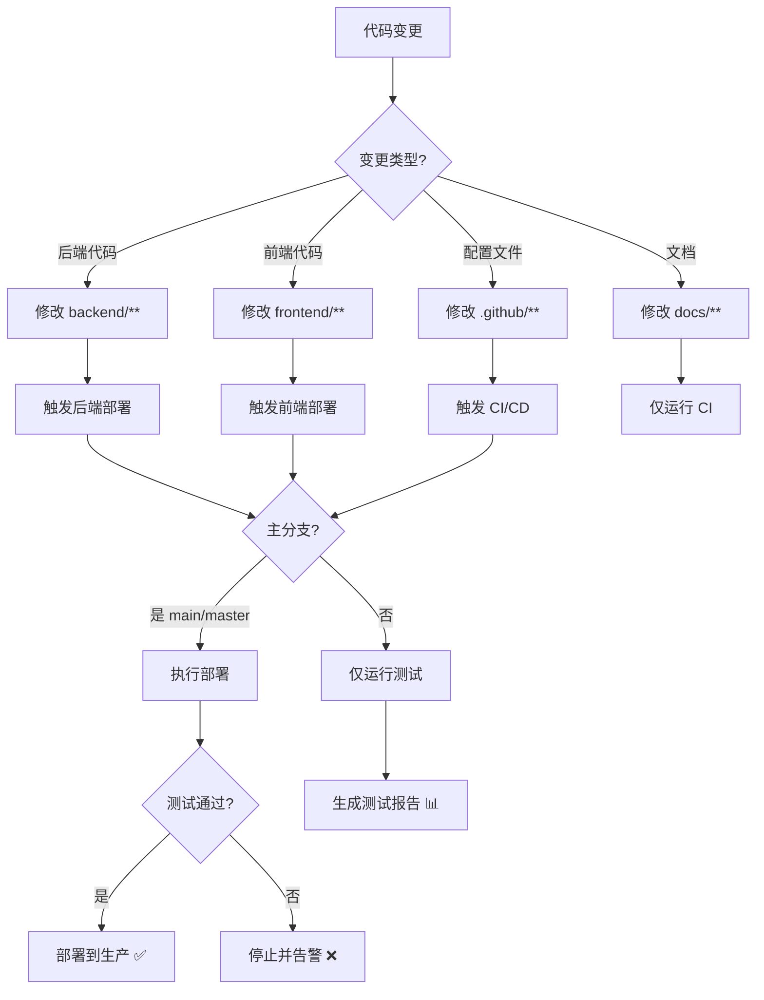

## 🔄 回滚策略

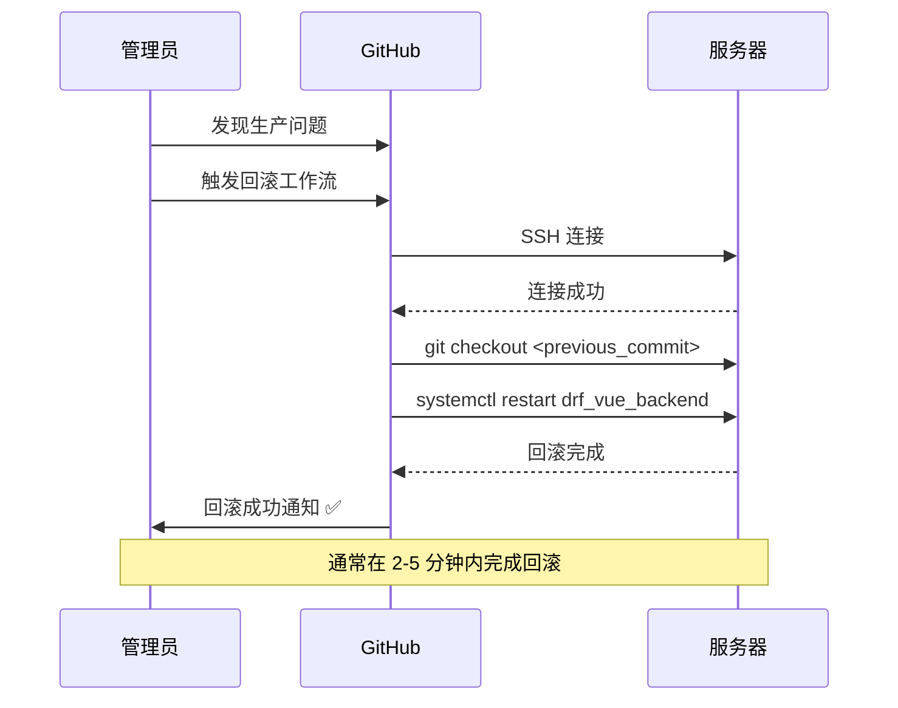

## 📈 监控架构

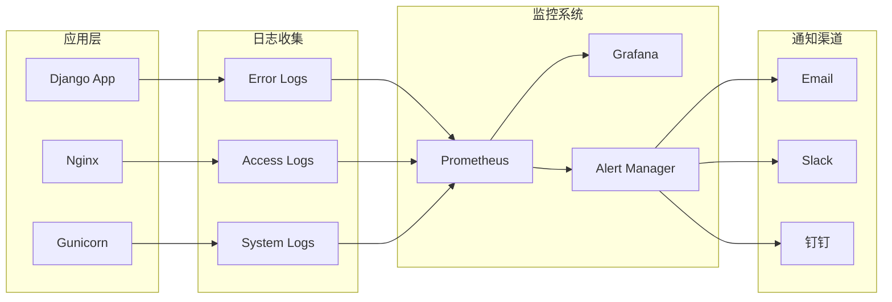

## 🎯 性能优化流程

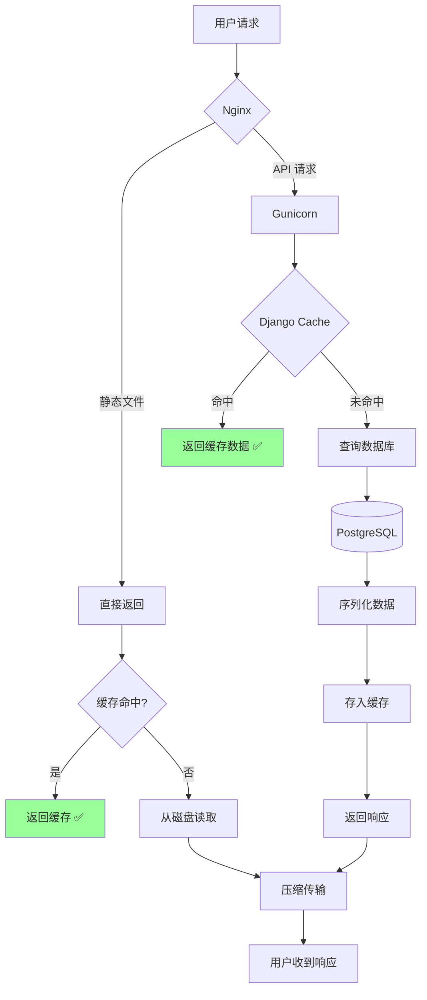

## 🔧 故障排查流程

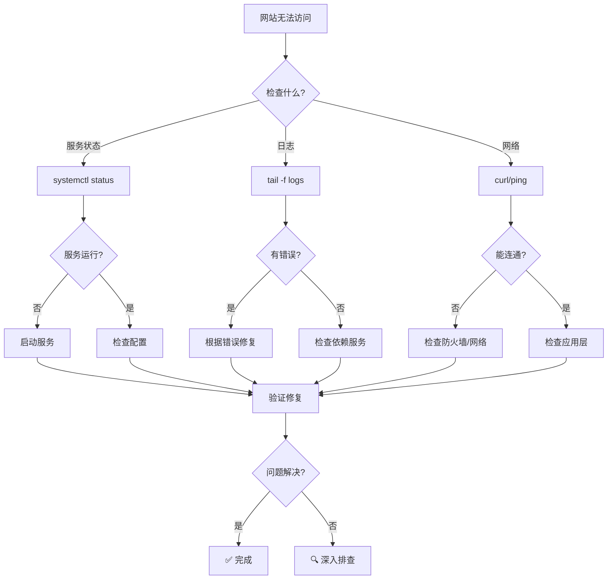

---

**提示：** 这些图表使用 Mermaid 语法，可以在支持 Mermaid 的 Markdown 编辑器中查看（如 GitHub、GitLab、VS Code 等）。
