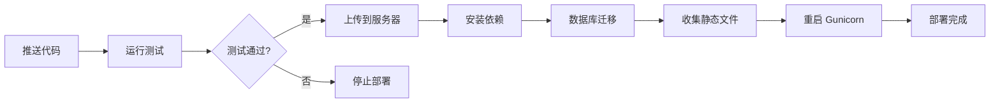
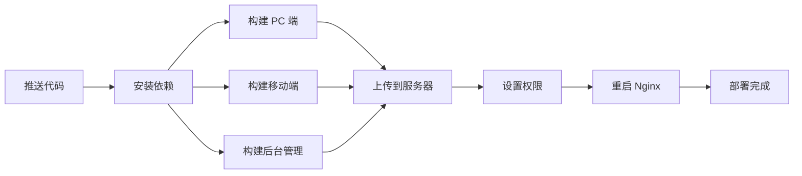

# GitHub Actions 自动化部署配置总览

## 📁 文件结构

```
.github/
├── workflows/
│   ├── ci-cd.yml              # 完整的 CI/CD 流水线（测试 + 构建）
│   ├── deploy-backend.yml     # 后端专属部署工作流
│   └── deploy-frontend.yml    # 前端专属部署工作流
├── gunicorn.service           # Gunicorn systemd 服务配置文件
├── setup_server.sh            # 服务器一键配置脚本
├── .env.production.example    # 生产环境变量示例
├── DEPLOYMENT_GUIDE.md        # 详细部署指南（完整版）
├── QUICK_START.md             # 快速开始指南（5分钟）
└── README_GITHUB_ACTIONS.md   # 本文件（总览）
```

## 🎯 工作流程说明

### 1. CI/CD Pipeline (`ci-cd.yml`)

**触发条件：**
- 推送到 main/master 分支
- 创建 Pull Request
- 手动触发

**执行任务：**
- ✅ 后端单元测试（使用 PostgreSQL）
- ✅ 前端项目构建（PC + Mobile + Admin）
- ✅ 代码质量检查
- ❌ 不执行实际部署（仅作为质量门禁）

**适用场景：**
- Pull Request 验证
- 代码质量保障
- 持续集成测试

### 2. Backend Deployment (`deploy-backend.yml`)

**触发条件：**
- 推送到 main/master 分支且 `backend/**` 目录有变化
- 手动触发

**执行流程：**


**特点：**
- 🧪 先测试后部署
- 🗄️ 自动执行数据库迁移
- 🔄 零停机重启
- 📊 代码覆盖率报告

### 3. Frontend Deployment (`deploy-frontend.yml`)

**触发条件：**
- 推送到 main/master 分支且 `frontend/**` 目录有变化
- 手动触发

**执行流程：**


**特点：**
- 🏗️ 同时构建三个前端项目
- 📱 支持 PC、移动端、后台管理
- 🔐 自动设置文件权限
- ⚡ 增量上传（rsync）

## 🔐 必需的 GitHub Secrets

在 **Settings → Secrets and variables → Actions** 中配置：

| Secret | 说明 | 获取方式 |
|--------|------|----------|
| `SERVER_HOST` | 服务器 IP 或域名 | 你的服务器地址 |
| `SERVER_USER` | SSH 登录用户名 | 通常是 root 或 deployer |
| `SERVER_PORT` | SSH 端口号 | 默认 22 |
| `SSH_PRIVATE_KEY` | SSH 私钥 | `cat ~/.ssh/deploy_key` |
| `VITE_API_BASE_URL` | 前端 API 地址 | `https://your-domain.com/api/` |

**可选 Secrets：**

| Secret | 说明 |
|--------|------|
| `CODECOV_TOKEN` | Codecov 代码覆盖率令牌 |

## 🚀 快速开始（3 步部署）

### 步骤 1：服务器准备

```bash
# 在服务器上执行
wget https://raw.githubusercontent.com/YOUR_USERNAME/YOUR_REPO/main/.github/setup_server.sh
chmod +x setup_server.sh
sudo bash setup_server.sh
```

### 步骤 2：配置 Secrets

复制 SSH 私钥并添加到 GitHub：

```bash
# 在服务器上查看私钥
cat /root/.ssh/github_actions/deploy_key

# 复制到 GitHub Secrets: SSH_PRIVATE_KEY
```

添加其他 4 个必需 secrets（见上表）。

### 步骤 3：推送代码

```bash
git add .
git commit -m "feat: setup GitHub Actions"
git push origin main
```

然后在 GitHub Actions 页面查看执行状态。

## 📋 部署前检查清单

### 服务器端

- [ ] Python 3.11+ 已安装
- [ ] Node.js 18+ 已安装（如果需要服务器端构建）
- [ ] Nginx 已安装并运行
- [ ] PostgreSQL/MySQL 已安装并配置
- [ ] SSH 密钥已生成并测试连接
- [ ] 防火墙已配置（开放 22、80、443 端口）
- [ ] 目录结构已创建（`/home/DRF_VUE/drf_vue/backend`、`/home/front`）

### 项目配置

- [ ] `.env` 文件已配置（参考 `.env.production.example`）
- [ ] 数据库已创建
- [ ] Django SECRET_KEY 已生成
- [ ] ALLOWED_HOSTS 已配置
- [ ] CORS_ALLOWED_ORIGINS 已配置

### GitHub 配置

- [ ] 5 个必需 Secrets 已配置
- [ ] SSH 私钥格式正确（包含 BEGIN 和 END 行）
- [ ] 服务器 IP/域名可访问

## 🔧 自定义配置

### 修改部署路径

编辑工作流文件中的环境变量：

```yaml
# deploy-backend.yml
env:
  BACKEND_PATH: /your/custom/path/backend

# deploy-frontend.yml
env:
  FRONTEND_PATH: /your/custom/path/front
```

### 修改触发条件

```yaml
on:
  push:
    branches: [ develop ]  # 改为 develop 分支
    paths:
      - 'backend/**'
```

### 添加通知功能

在部署成功后发送通知（钉钉、企业微信、Slack 等）：

```yaml
- name: Send notification
  if: success()
  uses: actions-cool/maintain-one-comment@v3
  with:
    body: '✅ 部署成功！'
```

### 添加回滚机制

创建回滚工作流 `.github/workflows/rollback.yml`：

```yaml
name: Rollback Deployment

on:
  workflow_dispatch:
    inputs:
      commit_hash:
        description: '回滚到的提交哈希'
        required: true

jobs:
  rollback:
    runs-on: ubuntu-latest
    steps:
      - name: Rollback backend
        run: |
          ssh ${{ secrets.SERVER_USER }}@${{ secrets.SERVER_HOST }} << EOF
            cd /home/DRF_VUE/drf_vue/backend
            git checkout ${{ github.event.inputs.commit_hash }}
            systemctl restart drf_vue_backend
          EOF
```

## 📊 监控和日志

### GitHub Actions 日志

访问：`https://github.com/YOUR_USERNAME/YOUR_REPO/actions`

### 服务器日志

```bash
# 后端日志
sudo tail -f /var/log/gunicorn/error.log
sudo tail -f /var/log/gunicorn/access.log

# Nginx 日志
sudo tail -f /var/log/nginx/error.log
sudo tail -f /var/log/nginx/access.log

# 系统日志
sudo journalctl -u drf_vue_backend -f
sudo journalctl -u nginx -f
```

### 性能监控

```bash
# 实时监控系统资源
htop

# 查看磁盘使用
df -h

# 查看内存使用
free -h

# 查看网络连接
netstat -tulpn | grep :8001
netstat -tulpn | grep :80
```

## 🐛 常见问题

### Q1: SSH 连接失败？

**A:** 检查以下几点：
1. SSH 私钥格式是否正确（每行末尾无空格）
2. 服务器防火墙是否开放 SSH 端口
3. SSH 公钥是否添加到 `~/.ssh/authorized_keys`
4. 测试连接：`ssh -i deploy_key -p PORT user@host`

### Q2: 部署成功但网站无法访问？

**A:** 按顺序检查：
1. `sudo systemctl status drf_vue_backend` - 后端是否运行
2. `sudo systemctl status nginx` - Nginx 是否运行
3. `sudo nginx -t` - Nginx 配置是否正确
4. `curl http://localhost:8001/api/` - 后端 API 是否响应
5. 浏览器控制台是否有错误

### Q3: 数据库迁移失败？

**A:** 
```bash
# 手动执行迁移查看详细错误
cd /home/DRF_VUE/drf_vue/backend
source venv/bin/activate
python manage.py migrate --traceback

# 检查数据库连接
python manage.py dbshell
```

### Q4: 静态文件 404？

**A:**
```bash
# 重新收集静态文件
cd /home/DRF_VUE/drf_vue/backend
source venv/bin/activate
python manage.py collectstatic --noinput

# 检查 Nginx 配置
grep -A 5 "location /static/" /etc/nginx/nginx.conf

# 检查文件权限
ls -la /home/DRF_VUE/drf_vue/backend/staticfiles/
```

### Q5: 前端构建失败？

**A:**
```bash
# 清除缓存重新构建
cd frontend
rm -rf node_modules package-lock.json
npm install
npm run build

# 检查 Node.js 版本
node -v  # 应该是 18+

# 检查环境变量
echo $VITE_API_BASE_URL
```

## 🎓 最佳实践

### 1. 分支策略

```
main/master  - 生产环境（受保护）
develop      - 开发环境
feature/*    - 功能分支
hotfix/*     - 紧急修复
release/*    - 发布候选
```

### 2. 提交规范

```
feat: 新功能
fix: 修复 bug
docs: 文档更新
style: 代码格式
refactor: 重构
test: 测试相关
chore: 构建/工具变动
perf: 性能优化
```

### 3. 环境变量管理

- ✅ 使用 `.env` 文件管理敏感信息
- ✅ 不同环境使用不同的 `.env` 文件
- ✅ 永远不要将 `.env` 提交到 Git
- ✅ 使用 `.env.example` 作为模板

### 4. 数据库迁移

- ✅ 每次模型变更后创建迁移文件
- ✅ 在部署前测试迁移
- ✅ 备份数据库后再执行迁移
- ✅ 迁移失败时能够回滚

### 5. 安全建议

- ✅ 定期更新依赖包
- ✅ 使用强密码和密钥
- ✅ 启用 HTTPS
- ✅ 配置防火墙
- ✅ 限制 SSH 访问
- ✅ 定期备份数据
- ✅ 监控异常访问

## 📈 进阶优化

### 1. 使用 Docker

创建 `docker-compose.yml` 实现容器化部署：

```yaml
version: '3.8'

services:
  backend:
    build: ./backend
    ports:
      - "8001:8001"
    environment:
      - DJANGO_SECRET_KEY=${DJANGO_SECRET_KEY}
    volumes:
      - media_volume:/app/media
  
  nginx:
    image: nginx:alpine
    ports:
      - "80:80"
      - "443:443"
    volumes:
      - ./nginx.conf:/etc/nginx/nginx.conf
      - static_volume:/static
      - media_volume:/media

volumes:
  static_volume:
  media_volume:
```

### 2. 蓝绿部署

实现零停机部署策略：

```bash
# 部署到备用环境
# 测试通过后切换流量
# 失败时快速回滚
```

### 3. 自动化测试

增加更多测试类型：

- 单元测试（已有）
- 集成测试
- E2E 测试（Cypress/Playwright）
- 性能测试（Locust）
- 安全扫描（Bandit）

### 4. 监控告警

集成监控工具：

- **应用监控**: Sentry, New Relic
- **基础设施监控**: Prometheus + Grafana
- **日志聚合**: ELK Stack, Loki
- ** uptime 监控**: UptimeRobot, Pingdom

## 📞 获取帮助

1. **查看完整文档**: `.github/DEPLOYMENT_GUIDE.md`
2. **快速开始**: `.github/QUICK_START.md`
3. **GitHub Actions 文档**: https://docs.github.com/en/actions
4. **Django 部署文档**: https://docs.djangoproject.com/en/stable/howto/deployment/
5. **Nginx 文档**: https://nginx.org/en/docs/

## 📝 更新日志

### v1.0.0 (2026-04-28)
- ✨ 初始版本发布
- ✅ 后端自动化部署
- ✅ 前端自动化部署
- ✅ CI/CD 流水线
- ✅ 服务器配置脚本
- ✅ 完整文档

---

**祝部署顺利！** 🚀

如有问题，请查看对应的工作流日志或服务器日志进行排查。
