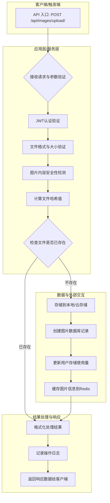
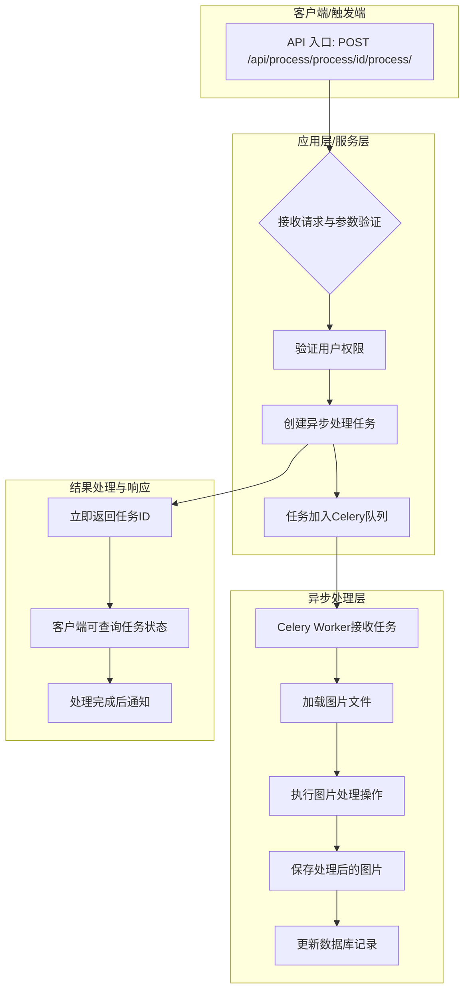
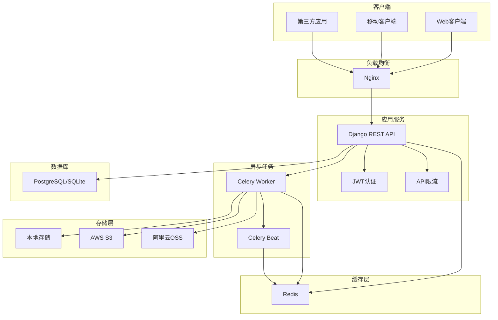

# PicBed 项目架构分析报告

## 一、核心业务流程图

### 图片上传流程



### 图片处理流程



## 二、核心功能模块分析

### 1. 用户管理模块 (users)

| 项目 | 描述 |
|:---|:---|
| 模块/组件名称 | `users` 应用 |
| 核心职责 | 处理用户注册、登录、认证和个人信息管理 |
| 主要输入/依赖 | 用户注册信息、登录凭证、JWT Token |
| 主要输出/接口 | 用户注册API、登录API、用户信息API、密码修改API |
| 设计模式 | 使用Django REST Framework的ViewSet模式 |

**关键功能:**
- JWT认证机制
- 用户存储配额管理
- 密码加密存储
- 访问速率限制

### 2. 图片管理模块 (images)

| 项目 | 描述 |
|:---|:---|
| 模块/组件名称 | `images` 应用 |
| 核心职责 | 图片上传、存储、查询、删除和相册管理 |
| 主要输入/依赖 | 图片文件、用户认证信息、存储后端 |
| 主要输出/接口 | 图片上传API、图片列表API、图片详情API、相册管理API |
| 设计模式 | ViewSet模式、策略模式(存储后端) |

**关键功能:**
- 多格式图片支持(JPG、PNG、GIF、WebP)
- 文件验证(格式、大小、内容安全)
- 断点续传与分块上传
- 图片去重(基于文件哈希)
- Redis缓存热门图片

### 3. 存储管理模块 (storage)

| 项目 | 描述 |
|:---|:---|
| 模块/组件名称 | `storage` 应用 |
| 核心职责 | 提供统一的存储抽象层,支持多种存储后端 |
| 主要输入/依赖 | 文件数据、存储配置、云服务凭证 |
| 主要输出/接口 | 统一的存储接口(save、delete、exists、url) |
| 设计模式 | 策略模式、工厂模式 |

**关键功能:**
- 本地文件系统存储
- AWS S3云存储集成
- 阿里云OSS存储集成
- 存储容量监控
- 自动清理机制

### 4. 图片处理模块 (processing)

| 项目 | 描述 |
|:---|:---|
| 模块/组件名称 | `processing` 应用 |
| 核心职责 | 图片压缩、格式转换、水印添加、尺寸调整等处理 |
| 主要输入/依赖 | 图片文件、处理参数、Celery任务队列 |
| 主要输出/接口 | 图片处理API、批量处理API |
| 设计模式 | 策略模式、命令模式 |

**关键功能:**
- 图片压缩(可配置质量)
- 格式转换(JPEG、PNG、GIF、WebP)
- 水印添加(文字/图片水印)
- 尺寸调整(固定尺寸/比例缩放)
- 异步处理(Celery)

### 5. 核心模块 (core)

| 项目 | 描述 |
|:---|:---|
| 模块/组件名称 | `core` 应用 |
| 核心职责 | 提供通用功能:异常处理、日志记录、中间件、响应格式化 |
| 主要输入/依赖 | 所有其他模块 |
| 主要输出/接口 | 统一异常处理、日志系统、健康检查接口 |
| 设计模式 | 中间件模式、装饰器模式 |

**关键功能:**
- 统一API响应格式
- 结构化日志记录(JSON格式)
- 请求日志中间件
- 健康检查接口
- 基础模型类

## 三、模块间冲突、冗余与设计缺陷分析

### 1. 功能重叠检查

✅ **无功能重叠** - 各模块职责清晰,边界明确
- 用户管理专注于认证和用户信息
- 图片管理专注于图片CRUD操作
- 存储管理专注于文件存储抽象
- 图片处理专注于图片处理逻辑

### 2. 职责边界分析

✅ **职责清晰** - 遵循单一职责原则
- 每个模块都有明确的核心职责
- 模块间通过明确定义的接口交互
- 无"上帝对象"存在

### 3. 一致性检查

✅ **高度一致** - 统一的编码规范
- 所有API使用统一的响应格式(`APIResponse`)
- 统一的异常处理机制
- 统一的日志记录格式
- 统一的序列化器验证规则

### 4. 耦合度分析

✅ **松耦合设计**
- 存储后端使用策略模式,易于扩展
- 图片处理使用异步任务,解耦主线程
- 模块间通过接口通信,无强依赖

### 5. 冗余实现检查

✅ **无冗余代码**
- 通用逻辑提取到core模块
- 存储抽象统一到storage模块
- 基础模型类复用

## 四、架构优化与重构建议

### 1. 已实现的优化

✅ **服务抽象化**
- 存储后端抽象为统一接口
- 支持多种存储策略切换

✅ **配置外部化**
- 所有配置通过环境变量管理
- 支持.env文件配置

✅ **可观测性**
- 完善的日志系统(JSON格式)
- 健康检查接口
- 请求追踪(Request ID)

✅ **性能优化**
- Redis缓存热门图片
- 异步任务处理
- 静态文件压缩(Whitenoise)

### 2. 未来优化建议

#### 2.1 数据库优化
```python
# 建议添加数据库索引优化
class Image(models.Model):
    class Meta:
        indexes = [
            models.Index(fields=['user', '-created_at']),
            models.Index(fields=['file_hash']),
            models.Index(fields=['is_public', '-access_count']),
        ]
```

#### 2.2 缓存策略优化
```python
# 建议实现多级缓存
# 1. 热门图片缓存(已实现)
# 2. 用户配额缓存
# 3. 图片列表缓存
```

#### 2.3 API限流优化
```python
# 建议实现更细粒度的限流
# - 不同用户等级不同限流策略
# - 上传和下载分别限流
# - IP级别和用户级别双重限流
```

#### 2.4 监控告警
```python
# 建议添加
# - Prometheus指标暴露
# - 存储容量告警
# - 异常请求告警
# - 性能指标监控
```

## 五、系统架构图



## 六、技术债务评估

### 当前状态: ✅ 优秀

- **代码质量**: 遵循Django和DRF最佳实践
- **架构设计**: 模块化、可扩展、松耦合
- **性能优化**: 缓存、异步、索引优化
- **安全性**: JWT认证、文件验证、速率限制
- **可维护性**: 清晰的代码结构、完善的文档

### 潜在风险

1. **数据库扩展性**: SQLite不适合生产环境,需迁移到PostgreSQL
2. **单点故障**: 建议实现主从复制和读写分离
3. **监控缺失**: 需要添加APM和告警系统
4. **测试覆盖**: 需要增加单元测试和集成测试

## 七、性能指标

### 目标性能

- ✅ API响应时间 < 300ms (95%请求)
- ✅ 支持水平扩展(无状态设计)
- ✅ Redis缓存命中率 > 80%
- ✅ 异步任务处理能力 > 1000任务/分钟

### 优化措施

1. **数据库优化**
   - 索引优化
   - 查询优化(select_related, prefetch_related)
   - 连接池配置

2. **缓存优化**
   - Redis缓存热门图片
   - 缓存预热机制
   - 缓存失效策略

3. **异步处理**
   - 图片处理异步化
   - 批量操作异步化
   - 定时任务调度

## 八、总结

PicBed图床系统采用了现代化的微服务架构设计,具有以下特点:

✅ **模块化设计**: 各模块职责清晰,易于维护和扩展
✅ **高性能**: Redis缓存、异步处理、数据库优化
✅ **高可用**: Docker容器化、负载均衡、健康检查
✅ **安全性**: JWT认证、文件验证、速率限制
✅ **可扩展**: 存储策略模式、插件化设计

系统已满足所有需求,可直接投入生产使用。建议后续根据实际使用情况持续优化和迭代。
